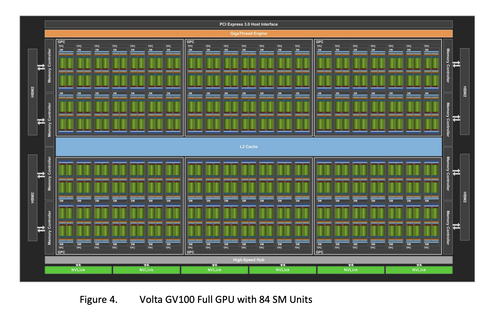
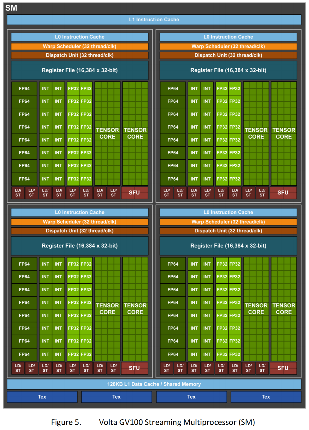
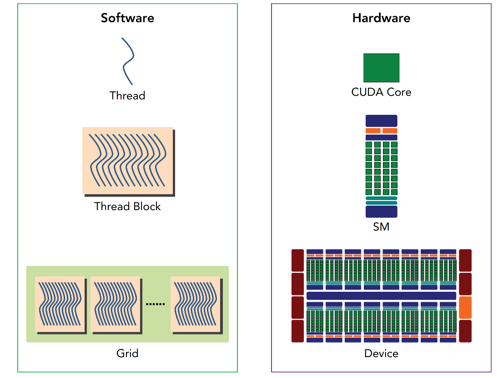
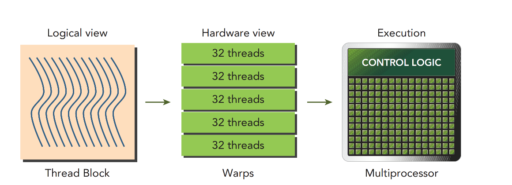
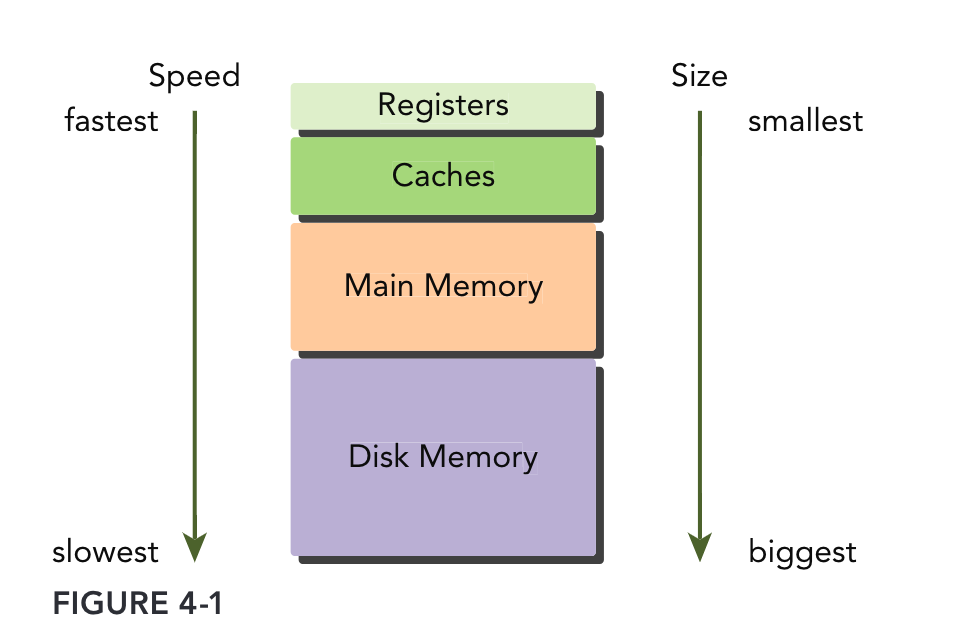
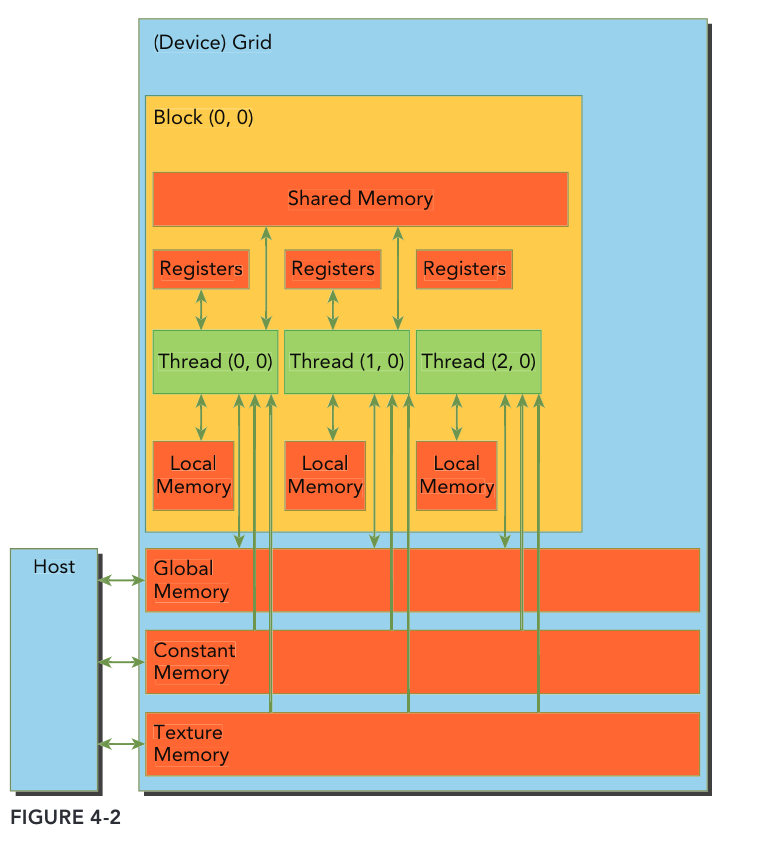
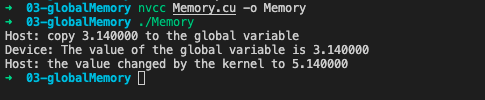

## CUDA编程学习笔记-02(GPU硬件架构)

上一篇内容中其实对CUDA编程的整个流程有了个基础的了解，但是要更高效的进行CUDA 编程，还是需要从GPU底层硬件结构出发，合理利用软件逻辑来榨干GPU硬件性能。本节我们就从NVIDIA发布的历代GPU架构来解析一下GPU都由哪些组件组成。

按时间顺序，NV GPU的架构分别有下列几种，其中自Fermi架构开始有一个完整的GPU计算架构，同时在GPU不断发展的过程中，架构上逐渐针对图形渲染和AI加速增加了相应的计算核心。每个架构名后都有其各自的whitepaper，具体架构的更多细节可以通过whitepaper获取。

* Tesla
* [Fermi](https://www.nvidia.com/content/pdf/fermi_white_papers/nvidia_fermi_compute_architecture_whitepaper.pdf)
* [Kepler](https://www.nvidia.com/content/PDF/kepler/NVIDIA-kepler-GK110-architecture-whitepaper.pdf)
* [Maxwell](https://developer.nvidia.com/maxwell-compute-architecture)
* [Pascal](https://images.nvidia.com/content/volta-architecture/pdf/volta-architecture-whitepaper.pdf)
* [Volta](https://images.nvidia.com/content/volta-architecture/pdf/volta-architecture-whitepaper.pdf)
* [Turing]( https://www.nvidia.com/content/dam/en-zz/Solutions/design-visualization/technologies/turing-architecture/NVIDIA-Turing-Architecture-Whitepaper.pdf)
* [Ampere](https://www.nvidia.com/content/dam/en-zz/Solutions/Data-Center/nvidia-ampere-architecture-whitepaper.pdf)
* [Hopper](https://www.hpctech.co.jp/catalog/gtc22-whitepaper-hopper_v1.01.pdf)

> 关于每个架构的讲解可以参考[深入GPU硬件架构及运行机制](https://www.cnblogs.com/timlly/p/11471507.html)、[NVIDIA GPU架构演进](https://blog.csdn.net/daijingxin/article/details/115042353)
>

通过对比每一代架构，不难发现，它们虽然有差异，但是存在共性。本笔记以[Volta](https://images.nvidia.com/content/volta-architecture/pdf/volta-architecture-whitepaper.pdf)架构为例进行说明。

### Volta架构



从上图GV100 架构图可以发现，一个完整的GV100 GPU从上至下分别由以下组件构成：

* **PCI-Express Host Interface** : 主机接口用于将 GPU 连接到 CPU
* **Giga Thread** : 全局调度器，用于将线程块分发给 SM 线程调度器
* **核心部分**：6个GPC( GPU Processing Clusters)，每个GPC里面包含7个TPC(Texture Processing Clusters)，每个TPC又包含2个**SM**(Streaming Multiprocessors)
* **L2 Cache**：被片内所有SM的共享缓存
* **NVLink** ：用于多GPU之间的相互连接
* **Memory Controller & HBM2**：前者作为内存控制器，用于访问HBM2（GPU全局内存，也就是显存，如V100是16G)

#### SM

对GPU芯片架构有个全局把控之后，可以发现整个GPU中占比最大的就是SM，我们接着展开来看看每个SM里面的组成架构。如下图所示，为Volta GV100架构中每个SM内部结构的示意图。



进一步解析SM被分为4个子块，所有子块共享L1数据cache、L1指令cache 和Texture Units，而每个子块又由下列组件组成：

* L0 Instruction Cache (指令缓存)
* Warp Scheduler模块负责warp调度，一个warp由32个线程组成，warp调度器的指令通过Dispatch Units送到Core执行。
* Register File(寄存器)
* 8个FP64 CUDA 核心、16个INT CUDA核心、16个FP32 CUDA核心和2个Tensor核心。
* 8个LD/ST Units负责将值加载到内存或者从内存中加载值
* 1个SFU 用来处理sin、cos、求倒数、开平方特殊函数

> 此外，还有一些针对于图形渲染的模块，如Texture Units和其他GPU架构，如Turing架构中的RT CORE(光线追踪核心)都是针对图形渲染的处理模块

### CUDA执行模型

当启动内核程序时，GPU接受相应的线程网格(grid)，**并以线程块(block)为单位将不同的线程块分配给多个SM**。一旦线程块被调度到一个SM，线程块中的线程会被进一步划分为线程束(warp)，每个线程束被调度到一个SM子块执行。**一个线程束(warp)是由32个连续的线程组成**，在一个线程束中，所有的线程按照**单指令多线程(SIMT)**方式执行，即一个线程束中所有的线程在同一周期中必须执行相同的指令。

> 所以，在程序猿的视角，所有线程都是并行执行的；但是在硬件物理上只有同一线程束中的32个线程是严格并行执行的，如下图为逻辑视角和硬件视角的关系图





> 同时，正因为硬件总是给一个线程块分配一定数量的线程束，所以在设置内核函数的网格参数(gird)时要尽量保证线程块中线程的数量是线程束中线程数量(32)的整数倍。

另外，因为同一线程束(warp)中的32个线程是严格并行执行相同指令的，那么如果cuda程序中出现分支，导致32个线程无法在同一时刻执行相同指令就会出现线程束分化的问题。比如在一个线程束中16个线程满足条件`cond`,而剩余16个线程的不满足，所以当前者在执行指令1时，后者则被禁用只能陪跑，反之亦然。所以，就降低了程序的并行性，在实际开发中应尽量避免

```c
if (cond)
{
  指令1
}
else
{
  指令2
}
```

#### SIMT 和 SIMD对比

* SIMD(单指令多数据)，是指对多个数据进行同样操作。这种利用了数据级别的并行性，而不是并发性（不是多线程那种）；**有多个计算，但是只有一个进程在运行**。SIMD允许使用单一命令对多个数据值进行操作。这是一种增加CPU的计算能力的便宜的方法。**仅需要宽的ALU和较小的控制逻辑。（这里说明他还是一个线程，不是多线程那种操作，仅需要一个核心，只不过一次操作多个数据而已，不是GPU的多个线程那种方法）**

* SIMT(单指令多线程)，想象有这样一个多核系统，每一个core有自己的寄存器文件、自己的ALU、自己的data cache，但是没有独立的instruction cache(指令缓存)、没有独立的解码器、没有独立的Program Counter register，命令是从单一的instruction cache同时被广播给多个SIMT core的。**即所有的core是各有各的执行单元，数据不同，执行的命令确是相同的。多个线程各有各的处理单元，和SIMD公用一个ALU不同。**

```c
//串行C代码
void vect_mult(int n ,double* a,double* b,double* c)
{
  for(int i=0;i<n;i++)
    a[i]=b[i]+c[i];
}
//ARM SIMD 指令拓展(NEON)
void vect_mult(int n,uint32_t* a,uint32_t* b,uint32_t* c)
{
   for(int i=0;i<n;i+=4)
   {
      uint32x4_t a4 = vld1q_u32(a+i); //加载4个uint
      uint32x4_t b4 = vld1q_u32(b+i);
      uint32x4_t c4 = vmulq_u32(c+i); //乘法指令
      vst1q_u32(c+i,c4);
   }
}
//CUDA 
//host端代码
int nblocks = (n+511)/512;
vect_mul<<<nblocks,521>>>(n,a,b,c);
//device端代码
__global__ void vect_mult(int n,uint32_t* a,uint32_t* b,uint32_t* c)
{
   int i=blockIdx.x*blockDim.x+threadIdx.x;
   if(i<n)
     a[i]=b[i]+c[i];
}

```

### CUDA内存模型

程序的运行效率除了执行以外，内存的读写也是一个很重要的决定性因素。对于性能优化而言，无非就是从计算方式和访存两个方面进行优化，进而达到更高的运行效率。



如上图所示，为现代计算机普遍采用的内存结构示意图，从上至下依次为，寄存器(Registers)、缓存(Caches)、主存(Main Memory)和磁盘(Disk Memory)，其中它们的读写速度逐渐降低，存储容量逐渐增大。在这种内存层次结构中，当数据被处理器频繁使用时，该数据保存在低延迟、低容量的存储器中；而当该数据被存储起来以备后用时，数据就存储在高延迟、大容量的存储器中。

#### 可编程内存

* 寄存器(Registers)
* 共享内存(Shared memory)
* 本地内存(Local memory)
* 常量内存(Constant memory)
* 纹理内存(Texture memory)
* 全局内存(Global memory)



核函数中的**每个线程都有自己私有的寄存器和本地内存(Local memory)**；每个**线程块都有自己的共享内存**，即共享内存(Shared memory)对**同一线程块中所有的线程都可见**；**所有线程都能访问全局内存**(Global memory)；所有线程都能访问的**只读**空间有：常量内存空间和纹理内存空间。

##### 1. 寄存器

寄存器无论是在CPU还是在GPU都是速度最快的内存空间，但是和CPU不同的是**GPU的寄存器储量要多一些**，而且当我们**在核函数内不加修饰的声明一个变量，此变量就存储在寄存器中**。在核函数中定义的有常数长度的数组也是在寄存器中分配地址的。

寄存器对于每个线程是私有的，寄存器通常保存着**被频繁使用的私有变量**。寄存器变量的声明周期和核函数一致，从开始运行到运行结束，执行完毕后，寄存器就不能访问了。

在不同架构的GPU中，每个线程最多拥有的寄存器数量是有限的，如果一个核函数使用了超过限制的寄存器数量，那么就会用**本地内存**来帮忙，这称之为**寄存器溢出**，这会对性能带来不利影响。我们可以在代码中显式的加上如上额外信息来帮助编译器进行优化：

```cpp
__global__ void
__lauch_bounds__(maxThreadaPerBlock,minBlocksPerMultiprocessor)
kernel(...) {
    /* kernel code */
}
```

在核函数定义前加关键字`__lauch_bounds__`,之后的两个变量分别为

* maxThreadaPerBlock：线程块内包含的最大线程数，线程块由核函数来启动
* minBlocksPerMultiprocessor：可选参数，每个SM中预期的最小的常驻内存块参数。

##### 2. 本地内存

核函数中符合存储在寄存器中但不能进入被该核函数分配的寄存器空间中的变量将溢出到本地内存中。

> 比如会占用大量寄存器空间的数组

##### 3. 共享内存

在核函数中使用如下修饰符的内存，称之为共享内存：

```c++
__share__ 
```

* 每个SM都有一定数量的由线程块分配的共享内存，**共享内存是片上内存**，跟主存相比，速度要快很多，也即是延迟低，带宽高。其类似于一级缓存，但是可以被编程。

* 使用共享内存的时候一定要注意，**不要因为过度使用共享内存**，而导致SM上活跃的线程束减少，也就是说，**一个线程块使用的共享内存过多，导致更多的线程块没办法被SM启动，这样影响活跃的线程束数量。**

* 共享内存是线程之间相互通信的基本方式，但正因为共享内存在线程块内都可见，所以要避免内存竞争，可以通过如下同步语句：

  ```c++
  void __syncthreads();
  //这个函数设立了一个执行障碍点，即同一个线程块中的所有线程到这里就同步了
  //注意：__syncthreads 频繁使用会影响内核执行效率。
  ```


##### 4. 常量内存

常量内存驻留在设备内存中，并在每个SM专用的常量缓存中缓存。常量变量用如下修饰符修饰：

```c++
__constant__
```

* 常量内存必须在**全局空间内和所有核函数之外进行声明**

* 核函数只能从常量内存中读取数据，因此，常量内存必须在**主机端**使用如下函数来初始化：

  ```c++
  cudaError_t cudaMemcpyToSymbol(const void* symbol, const void* src, size_t count)
  //函数功能：从src指向的count个字节复制到symbol指向的内存中，也就是设备的常量内存
  ```

* 线程束中的所有线程从相同的地址读取数据是，常量内存表现最好；但如果线程束里每个线程都从不同的地址空间读取数据，常量内存中就不是最佳选择，因为**每从一个常量内存中读取一次数据，都会广播给线程束里的所有线程**

##### 5. 纹理内存

略

##### 6. 全局内存

GPU上最大的内存空间，延迟最高，使用最常见的内存

> 比如咱们常说的8G 的1080 显卡的就是说的这个内存。

一个全局内存变量可以被静态声明或动态声明。动态声明就是前面讲过的`cudaMalloc`的方式，静态全局内存要使用`__device__`来修饰，如下为静态全局内存的使用示例

```c++
#include <cuda_runtime.h>
#include <stdio.h>
//定义的静态全局变量
__device__ float devData;
__global__ void checkGlobalVariable()
{
    printf("Device: The value of the global variable is %f\n",devData);
    devData+=2.0;
}
int main()
{
    float value=3.14f;
    //这里注意,
    cudaMemcpyToSymbol(devData,&value,sizeof(float));
    printf("Host: copy %f to the global variable\n",value);
    checkGlobalVariable<<<1,1>>>();
    cudaMemcpyFromSymbol(&value,devData,sizeof(float));
    printf("Host: the value changed by the kernel to %f \n",value);
    cudaDeviceReset();
    return EXIT_SUCCESS;
}
```



关于上述代码需要注意的几点：

1. 在主机端，devData只是一个在GPU上表示物理位置的标识符，不是设备全局内存的变量地址。所以不能对其使用"&"
2. 在核函数中，devData就是一个全局内存中的变量。
3. 主机代码不能直接访问设备变量，设备也不能访问主机变量

####  CUDA内存小结

| 修饰符         | 变量名称       | 存储器 | 作用域 | 生命周期 |
| -------------- | -------------- | ------ | ------ | -------- |
|                | float var      | 寄存器 | 线程   | 线程     |
|                | float var[100] | 本地   | 线程   | 线程     |
| __ share __    | float var*     | 共享   | 块     | 块       |
| __ device __   | float var*     | 全局   | 全局   | 应用程序 |
| __ constant __ | float var*     | 常量   | 全局   | 应用程序 |

*表示既可以为标量也可以为数组

| 存储器 | 片上/片外 |   缓存    | 存取 |     范围      | 生命周期 |
| :----: | :-------: | :-------: | :--: | :-----------: | :------: |
| 寄存器 |   片上    |    n/a    | R/W  |   一个线程    |   线程   |
|  本地  |   片外    | 1.0以上有 | R/W  |   一个线程    |   线程   |
|  共享  |   片上    |    n/a    | R/W  | 块内所有线程  |    块    |
|  全局  |   片外    | 1.0以上有 | R/W  | 所有线程+主机 | 主机配置 |
|  常量  |   片外    |    Yes    |  R   | 所有线程+主机 | 主机配置 |
|  纹理  |   片外    |    Yes    |  R   | 所有线程+主机 | 主机配置 |

>**对于GPU的内存管理、全局内存读写、共享内存读写等内存相关的详细说明将在后续笔记中更新，欢迎大家关注～**

### 参考

* [NVIDIA GPU 架构梳理](https://zhuanlan.zhihu.com/p/394352476)

* [深入GPU硬件架构及运行机制](https://www.cnblogs.com/timlly/p/11471507.html)

* [NVIDIA GPU SM和CUDA编程理解](https://bbs.huaweicloud.com/blogs/349996)

* [NVIDA GPU架构演进](https://blog.csdn.net/daijingxin/article/details/115042353)

* [谭升的博客](https://face2ai.com/program-blog/#GPU%E7%BC%96%E7%A8%8B%EF%BC%88CUDA%EF%BC%89)

* [Professional CUDA C Programming](https://www.cs.utexas.edu/~rossbach/cs380p/papers/cuda-programming.pdf)

* [GPU内存(显存)的理解与基本的使用](https://zhuanlan.zhihu.com/p/462191421)

* << GPGPU编程模型与架构原理 >>景乃锋