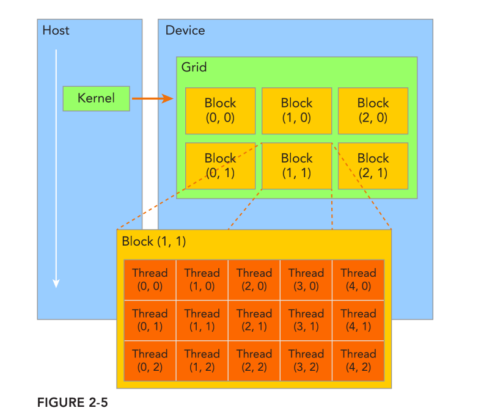

## CUDA编程学习笔记-01

### 1. 前言

谈到模型的推理加速，那么一个绕不开的话题就是异构计算，什么是异构计算呢？用我自己的理解就是，由不同体系架构的硬件组成的"计算系统"，因为不同体系架构的硬件适合处理的任务类型也是不同的，比如CPU适合处理控制密集型任务，而GPU适合处理计算密集型任务...  ，所以让合适的硬件处理合适的任务，就能更高效的利用硬件来完成计算任务。记得在本科的时候参加集成电路竞赛，当时的选题是使用ARM+FPGA实现一个车牌识别系统(FPGA进行识别并将结果通过总线传给ARM，ARM端接收识别结果并显示)，现在想来也应该属于异构计算的一种形式。

本文是笔者学习CUDA编程的第一份笔记，使用最常见的异构计算组合CPU+GPU，因为是刚开始学习，**如有表述错误，还请指出**。

* 配置：
  * Intel(R) Core i7-8700 CPU 
  * GTX 1080 GPU
  * Ubuntu 18.04
* 参考书籍：
  * 《[CUDA C编程权威指南](https://item.jd.com/12088317.html)》 [(英文版)](https://www.cs.utexas.edu/~rossbach/cs380p/papers/cuda-programming.pdf)

### 2. CUDA编程模型

在开始CUDA编程之前，我们需要先来了解一下为什么GPU相对于CPU更适合并行计算？要彻底的回答这个问题，还得从底层集成电路设计的角度来回答这个问题，因为笔者并非集成电路专业，所以只能简单的从CPU和GPU两者的体系结构上抽象的说明一下，如下图为这两者的架构示意图


对比两者的结构示意图不难发现，GPU采用了数量众多的计算单元和超长的流水线，但只有非常简单的控制逻辑并省去了Cache。而CPU不仅被Cache占据了大量空间，而且还有有复杂的控制逻辑和诸多优化电路，相比之下计算能力只是CPU很小的一部分。因为GPU的计算单元更多，也就意味着GPU能同时启动更多的进程来进行数据的计算，而相对于CPU，其逻辑控制能力就稍逊一筹，有得有失～

另外，上图还给了我们一个信息，就是CPU+GPU异构计算的方式，即CPU作为主机端(host)，而GPU作为设备端(device)，所以CPU处理复杂的控制运算，GPU处理数据并行计算，两者之间的信息交换可以通过总线进行传输。

-----

好了～对GPU和异构计算有个大概的了解以后，咱们开始进行CUDA编程～

####  2.1 CUDA核函数

>  在进行CUDA编程之前，我们需要安装好相应的GPU驱动/nvcc编译器等，网上相关的教程很多，这里就不赘述。

回想我们在学习C/C++时，第一个程序应该是输出一个"Hello World"，那么同样在学习CUDA编程时咱们也从这个简单程序入手，如下所示代码为使用GPU输出"Hello World"的示例代码，不难发现，相对于标准C多了一个以`__global__`开头的函数`helloFromGPU`，这个函数就是在GPU上执行的**CUDA核函数**了

```c++
#include<stdio.h>

//定义gpu 核函数
__global__ void helloFromGPU()
{
   printf("Hello World from GPU!\n");
}
int main()
{
    //hello from cpu
    printf("Hello World from CPU!\n");
    //调用核函数
    helloFromGPU<<<1,1>>>();
    cudaDeviceReset();
    return 0;
}
```

我们在标准C中编写完程序以后就会使用`gcc`来将`.c`文件转换为可执行文件，与之我们这里则使用`nvcc`编译器将`.cu`文件转换为可执行文件，如下命令，编译和执行

```shell
nvcc hello.cu -o hello
./hello
```

得到输出

```shell
Hello World from CPU!
Hello World from GPU!
```

至此，就算完成了CUDA的Hello World编写。同时通过上述代码，也引出了很多问题，比如：

* 调用核函数时<<<1,1>>>表示什么意思？能不能更改这两个值？

* 都说GPU作为设备端，那么GPU和CPU之间如何进行数据传输?      
* ..........

#### 2.2  CUDA 内存管理

我们先来回答第2个问题**GPU和CPU之间数据的传输**，所谓数据传输，那无非就是将数据从主机内存拷贝到GPU设备的内存中，要从主机内存拷贝数据到GPU内存，那么首先我们需要在GPU内存中申请一块区域作为接收数据的内存，然后在把数据copy过去，不错的是，CUDA已经为我们提供了这个过程所需要的函数～

如下表所示

| 标准C函数 | CUDA C 函数 | 说明                  |
| :-------: | :---------: | --------------------- |
|  malloc   | cudaMalloc  | 在CPU/GPU 申请内存    |
|  memset   | cudaMemset  | 为新内存做初始化      |
|  memcpy   | cudaMemcpy  | CPU/GPU之间的数据传输 |
|   free    |  cudaFree   | 释放CPU/GPU内存       |

其中`cudaMalloc`，`cudaMemset`，`cudaFree`的使用方法和参数列表与标准C中基本一致，`cudaMemcpy`的函数原型为:

```c++
/*
param-list:
* dst : 目标指针
* src : 原指针
* count: 指定字节数
* kind : 拷贝的类型(cudaMemcpyHostToHost ,cudaMemcpyHostToDevice , cudaMemcpyDeviceToHost  
                  ,cudaMemcpyDeviceToDevice)
return:
* cudaSuccess 成功
* cudaErrorMemoryAllocation 失败
*/
cudaMemcpy(void * dst ,const void*src,size_t count,cudaMemcpyKind kind)
```

有了以上的这些函数就能愉快在CPU/GPU之间进行基本的内存传输和处理了，关于更进阶的内存管理，后续进行说明，先留个坑～

#### 2.3 线程管理

>  在我们回答第一个问题--"**启动核函数时<<<1,1>>>表示什么意思**？"之前我们先来看看CUDA线程的层级结构管理

当核函数在主机端(CPU)启动时，它的执行会移动到GPU上，此时GPU中会产生大量线程，并且每个线程都执行由核函数指定的语句。而为了方便对这些线程进行管理，CUDA则是采用一种层级结构对这些线程进行区分，**如下图所示**，由一个内核函数启动所产生的所有线程统称为一个**网格(grid)** ,同一个网格中的所有线程共享相同的全局内存空间，一个网格由**多个块(blocks)**组成，每个块中包含**多个线程(Threads)**，且每种层级之间可以选择一维、二维、三维这三种结构，简单来说就是一个**网格(grid)**可以由一维/二维/三维结构的**块(blocks)**组成，一个**块(blocks)**可以由一维/二维/三维结构的**线程(threads)**组成，下图所示就是一个grid由二维结构的blocks组成，一个blocks由二维结构的threads组成。



使用这样的层级结构管理线程，就可以让线程通过下列**两个坐标变量来区分彼此**，进而达到线程管理的目的，当执行一个核函数时，CUDA运行时会为每个线程分配两个坐标变量，为uint3 类型

* **blockIdx**  : 块在网格中的索引

* **threadIdx** :  线程在块中的索引

这两个坐标变量都是一个结构体类型，其中有**x,y,z** 三个字段，这三个字段分别对应三个维度，刚好对应每个grid网络中的block的组织方式可以是一维、二维或三维，同理，每个block中的线程组织方式也可以是一维、二维或三维，根据**x,y,z**这三个字段也就知道其在各自维度上的坐标

另外，还有两个记录维数的变量，为dim3 类型

* **blockDim**  :每个block在三个维度上的线程数（没有用到的维度，维数初始化为1）
* **gridDim** ： 每个grid在三个维度上的块数（没有用到的维度，维数初始化为1）

而这两个变量也有**x,y,z** 三个字段，与上述两个坐标变量不同的是，这三个字段分别记录的是每个维度上的**维数**而非坐标。


有了这种层级结构的线程管理的概念之后，我们来回答第一个问题--"**启动核函数时<<<1,1>>>表示什么意思**？"

我们调用核函数时使用的`<<< gridsize , blocksize >>>` 是用来**配置**这种层级管理结构的，其中`gridsize`表示的是网格中`block`的维度，`blocksize`表示的是每个`block`中线程的维度，比如前面我们在调用核函数时使用`<<<1,1>>>`是用来配置核函数，那么也就是说此函数使用1个`block`中有1个`线程` 的层级结构来执行此函数，效果也就是使用单线程来输出`"Hello World from GPU!\n"`；当然我们可以修改`gridsize`和`blocksize`这两者的值，比如我们可以使用`<<<1,5>>>` 或者`<<<5,1>>>`来配置组织方式，运行时都将输出5个`"Hello World from GPU!\n"`,但这两者的组织方式是不一样的，前者是用1个`block`中有5个`线程`来执行此核函数，后者则是通过5个`block`，每个block中有1个线程的方式来执行

#### 2.4 线程的Index

我们接着来进一步讨论一下线程的索引，前面说过线程之间可以通过blockIdx和threadIdx这两个索引即可区分彼此，也就说通过这两者我们可以计算出每个线程的**全局索引**，而计算的方式有多种，这里以2D Grid - 2D Block为例子进行说明

* **方式1(源于<CUDA C 编程权威指南>)**


* **方式2(源于[网络](https://cs.calvin.edu/courses/cs/374/CUDA/CUDA-Thread-Indexing-Cheatsheet.pdf))**


> 注意：这是两种方式！简单编写代码就能验证两种index方式不同 

```cpp
//用代码来描述
//方式1
__device__ int getGlobalIdx_2D_2D_1()
{
    int ix = threadIdx.x + blockIdx.x * blockDim.x;
    int iy = threadIdx.y + blockIdx.y * blockDim.y;
    unsigned int idx = iy*gridDim.x + ix;
    return idx;
}
//方式2
__device__ int getGlobalIdx_2D_2D_2()
{
    int blockId = blockIdx.x + blockIdx.y*gridDim.x;
    int threadId = blockId *(blockDim.x * blockDim.y) + (threadIdx.y*blockDim.x) + threadIdx.x;
    return threadId;
}
```

这里我们使用书中**采用的映射方式，即方式1**，并假设我们想使用核函数来并行处理一个8 * 6 的矩阵，同时我们以girdsize=(2,3), blocksize=(4,2)来配置核函数的启动方式，那么整体上线程的全局索引如下所示，之后再通过将线程的全局索引与矩阵的内存索引对应上，即可让每个线程一一对应的来访问矩阵中的元素

> 水平方向是x轴，垂直方向是y轴，也就分别对应坐标变量blockIdx、threadIdx 的x , y维度
>
> 每个小方块中黑色的数字即为通过**方式1**所计算得到的线程的全局索引，对于方式2所计算得到全局索引的布局情况可自行实验


####  2.5  使用GPU对矩阵求和

有了cuda内存管理和线程层级组织结构的概念以后，我们用一个实例来验证一下：实现一个矩阵加法的CUDA核函数

我们可以使用多种线程组织结构来实行并行的矩阵加法，而不同的组织结构之间的处理性能上会有差异，这个后续章节中会详细说明，我们先使用二维网格-二维线程块来实现(以下代码存为sumMatrix.cu文件)

```c++
#include<cuda_runtime.h>
#include<iostream>
#include<stdio.h>
#include<sys/time.h>
#define CHECK(call)                     \
{                                       \
    const cudaError_t error = call;     \
    if(error!=cudaSuccess)              \
    {                                   \
        printf("Error: %s:%d",__FILE__,__LINE__);      \
        std::cout<<"code: "<<error<<" ,reason: "<<cudaGetErrorString(error)<<std::endl;     \
        exit(-10*error);     \
    }                        \
}

//使用gettimeofday会获取自1970年1月1日0点以来到现在的秒数
//timeval是一个结构体，其中有成员 tv_sec:秒 tv_usec:微秒
double cpuSecond() {
    struct timeval tp;
    gettimeofday(&tp,NULL);
    return ((double)tp.tv_sec + (double)tp.tv_usec*1.e-6);
}
//初始化数组
void initialData(float *ip,int size)
{
    //generate different seed for random number
    time_t t;
    srand((unsigned)time(&t));
    for(int i=0;i<size;i++)
    {
        ip[i]=i;
    }
}
//hostRef传入CPU端计算的矩阵加法结果，gpuRef传入GPU端计算的矩阵加法结果
//对比争取输出"Arrats match"
void checkResult(float *hostRef,float *gpuRef,const int N)
{
    double epsilon = 1.0E-8;
    bool match=1;
    for(int i=0;i<N;i++)
    {
        if(abs(hostRef[i]-gpuRef[i])>epsilon)
        {
            match=0;
            printf("Arrays do not match");
            printf("host %5.2f gpu %5.2f at current %d\n",hostRef[i],gpuRef[i],i);
            break;
        }
    }
    if(match)
      std::cout<<"Arrats match"<<std::endl;

}
//cpu端计算矩阵加法
void sumMatrixOnHost(float *A,float *B,float *C,const int nx ,const int ny)
{
    float *ia=A;
    float *ib=B;
    float *ic=C;

    for(int iy=0;iy<ny;iy++)
    {
        for(int ix=0;ix<nx;ix++)
        {
            ic[ix]=ia[ix]+ib[ix];
        }
        ia += nx;
        ib += nx;
        ic += nx;
    }
}
//cuda核函数计算矩阵加法
__global__ void sumMatrixOnGPU(float *MatA,float *MatB,float *MatC,int nx,int ny)
{
    //使用前问中的线程全局索引的计算方式
    unsigned int ix = threadIdx.x + blockIdx.x * blockDim.x;
    unsigned int iy = threadIdx.y + blockIdx.y * blockDim.y;

    unsigned int idx = iy*nx + ix;
    if(ix<nx && iy<ny)
    {
        //这种线程的全局索引方式正好是与按行优先的存储的矩阵的索引方式是一致的
        //所以线程的全局索引可以与矩阵中元素的索引很好的对应
        MatC[idx] = MatA[idx] + MatB[idx];
    }

}


int main(int argc,char **argv)
{
    int dev = 0;
    cudaDeviceProp deviceProp;
    //CHECK宏定义检查操作是否正常处理
    CHECK(cudaGetDeviceProperties(&deviceProp,dev));
    printf("Using Device %d: %s\n",dev,deviceProp.name);
    CHECK(cudaSetDevice(dev));

    //set up data size of matrix
    int nx = 1<<14; //16384
    int ny = 1<<14; //16384

    int nxy = nx*ny;
    int nBytes = nxy*sizeof(float);
    printf("Matrix size: nx %d ny %d\n",nx,ny);
    //malloc host memory
    float *h_A,*h_B,*hostRef,*gpuRef;
    h_A = (float*)malloc(nBytes);
    h_B = (float*)malloc(nBytes);
    hostRef = (float*)malloc(nBytes);
    gpuRef = (float*)malloc(nBytes);

    //init data at host side
    double iStart = cpuSecond();
    initialData(h_A,nxy);
    initialData(h_B,nxy);
    double iElaps = cpuSecond() - iStart;

    memset(hostRef,0,nBytes);
    memset(gpuRef,0,nBytes);

    iStart = cpuSecond();
    sumMatrixOnHost(h_A,h_B,hostRef,nx,ny);
    iElaps = cpuSecond() - iStart; //cpu 端耗时
    std::cout<<"sumMatrixOnHost cost "<<iElaps<<"sec\n";

    //malloc device global memory
    //GPU 申请GPU端空间
    float *d_MatA,*d_MatB,*d_MatC;
    cudaMalloc((void**)&d_MatA,nBytes);
    cudaMalloc((void**)&d_MatB,nBytes);
    cudaMalloc((void**)&d_MatC,nBytes);

    //transfer data from host to device
    //数据传输
    cudaMemcpy(d_MatA,h_A,nBytes,cudaMemcpyHostToDevice);
    cudaMemcpy(d_MatB,h_B,nBytes,cudaMemcpyHostToDevice);

    //invoke kernel at host side
    int dimx = 32;
    int dimy = 32;
    //block size = (32,32)
    //也就是每个block中有32*32个线程（结构是二维）
    dim3 block(dimx,dimy);
    //grid size = (512,512)
    //也就是每个grid中有512*512个block （结构是二维）
    dim3 grid((nx+block.x-1)/block.x,((ny+block.y-1)/block.y));

    iStart = cpuSecond();//gpu初始时间
    sumMatrixOnGPU<<<grid,block>>>(d_MatA,d_MatB,d_MatC,nx,ny);//以上述配置线程层级结构的方式启动核函数
    cudaDeviceSynchronize();
    iElaps = cpuSecond() - iStart;
    printf("sumMatrixOnGPU<<<(%d,%d),(%d,%d)>>>elapsed %f sec\n",grid.x,grid.y,block.x,block.y,iElaps);

    //copy kernel result back to host side
    //再把GPU计算的结果拷贝会cpu端
    cudaMemcpy(gpuRef,d_MatC,nBytes,cudaMemcpyDeviceToHost);

    //check device res
    checkResult(hostRef,gpuRef,nxy);
    
    //释放gpu中申请的内存
    cudaFree(d_MatA);
    cudaFree(d_MatB);
    cudaFree(d_MatC);
    //释放主机端内存
    free(h_A);
    free(h_B);
    free(hostRef);
    free(gpuRef);

    //reset device 
    cudaDeviceReset();
    return (0);
}

```

使用如下命令来对cuda程序进行编译，得到可执行程序

```shell
nvcc sumMatrix.cu -o sumMatrix
```

最后通过NVIDIA提供的名为`nvprof`的命令行分析工具来帮助从应用程序的CPU和GPU活动情况中获取时间线信息

```shell
nvprof ./sumMatrix 
```


其中红色框为程序本身的输出，其他为`nvprof`工具的输出，不难发现，CPU端计算矩阵加法程序耗时为578.366ms，而GPU端耗时为12.691ms(这里注意使用`nvprof`得到的时间(蓝色框)相对于程序中使用`gettimeofday`稍微精准一些)，另外`nvprof`还给我们提供一个信息：CUDA memcpy的耗时相对于核函数的计算要高的多，所以在HPC中把握程序中通信比是非常重要的

### 3 . 最后

好啦～笔者的第一篇CUDA核函数编程的笔记到这里算是写完了，如有理解或表述错误的欢迎大家指出，后续笔记笔者会一边学习一边更新的～希望大家多多关注
