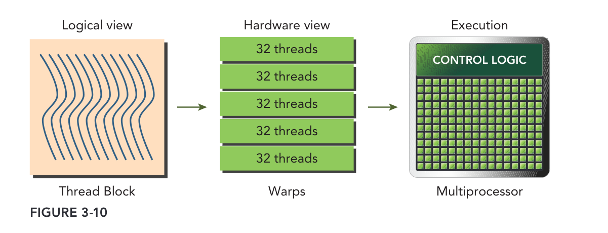

## CUDA编程学习笔记-02

上一篇文章中谈到启动核函数时采用不同的线程组织方式，会导致性能出现较大的差异，本一节也就主要是来探讨一下


### 1.  线程束和线程块

前文提到过，当一个核函数被执行，那么就会启用一个网格的线程来并行执行这个核函数，每个网格中的多个线程块(block)会被同时分配给可用的SM上执行，一旦线程块(block)被调度到一个SM上，线程块中的线程会被进一步分为**线程束**，每一个线程束一般是**32个线程**，在一个线程束中，所有线程按照单指令多线程SIMT的方式执行，也就是说一个线程束中的所有线程在同一周期中必须执行相同的指令，如下图为线程块和线程束的关系示意图



从逻辑的角度来看，一个线程块(block)是若干线程的集合，它们可以被组织为一维、二维或三维布局(方便我们写代码～)；而从硬件角度来看，线程块是**一维线程束**的集合，每32个连续线程组成一个线程束，换句话说就是 硬件会给每一个线程块分配一定数量的线程束，并

> https://bbs.huaweicloud.com/blogs/349996

### 2.  线程束分化

前面谈到一个线程束中的所有线程在同一周期中必须执行相同的指令，但如果有的线程满足执行条件 有的线程不满足执行条件，那么就会产生同一时刻线程执行不同的指令，也就违背了SIMT的方式，进而也就会影响并行性。比如下面这个例子

```cpp
__global__ void mathKernel1(float *c)
{
    int tid = blockIdx.x * blockDim.x + threadIdx.x;
    float a=0.0f,b=0.0f;
    //奇偶线程ID执行的指令不一致
    if(tid%2 ==0)
    {
        a = 100.0f;
    }
    else
        b = 200.0f;
    c[tid]=a+b;
}
```


> 注意：线程束分化只发生在同一个线程束中，在不通过的线程束中，不同条件只不会引起线程束分化


### 3.  并行归约问题

>  通过对比实验，可以总结出，一个块的最内层维数(blockDim.x)应该是线程束大小的倍数，这样能极大地提高效率。

首先我们来思考一个问题，对N个元素的整数数组求和。使用串行代码很容易实现

````cpp
int sum=0;
for(int i=0;i<N;i++)
{
   sum += nums[i];
}
````

