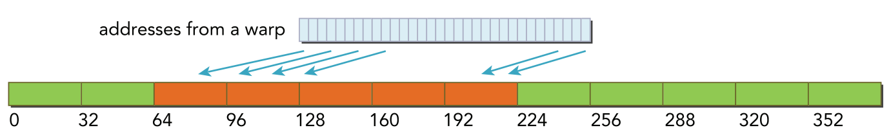

# CUDA编程学习笔记-03(内存访问)

在上一篇笔记中主要对GPU架构进行了说明，同时也不难发现，要想写好CUDA无非就是从计算方式和访存方式上进行优化。本节主要对GPU中常用的**全局内存**和**共享内存**的访问进行说明。

> 本节笔记为最后一节基础概念的笔记，之后的笔记将通过实际例子来聊聊CUDA编程的优化技巧

## 1  全局内存管理

### 1.1 内存分配与释放

* 内存分配函数

```c
// count : 所分配全局内存的字节 
// devptr：指针返回该内存的地址
cudaError_t cudaMalloc(void **devPtr, size_t count);
```

> 注意这里的参数devPtr为二级指针

* 内存释放函数

```c
// 如果地址空间已经被释放，那么cudaFree返回一个错误
cudaError_t cudaFree(void *devPtr);
```

### 1.2 内存传输

分配好全局内存，就可以使用下列函数进行内存传输

```c
// 函数从内存位置src复制count字节到内存位置dst
cudaError_t cudaMemcpy(void *dst, 
                       const void *src, 
                       size_t count,
                       enum cudaMemcpyKind kind);
/*
kind表示内存传输方向(要与src到dst保持一致)
kind取值：
cudaMemcpyHostToHost
cudaMemcpyHostToDevice
cudaMemcpyDeviceToHost
cudaMemcpyDeviceToDevice
*/
```


### 1.3 固定内存

对于主机端的内存而言，其默认是[pageable(可分页)](https://wdxtub.com/csapp/thin-csapp-7/2016/04/16/) ，在页面发生错误时，会将主机虚拟内存上的数据移动到不同的物理地址。而GPU不能在可分页主机内存上安全地访问数据，因为当主机操作系统在物理位置上移动该数据时，它无法控制。所以**当从可分页主机内存传输数据到设备内存时**， CUDA首先分配**固定**的**主机内存**，将主机源数据复制到**固定内存**中，然后从**固定内存传输数据给设备内存**。如下图左侧所示。


当然也可以直接通过如下函数分配和释放固定主机内存，示意图如上图右侧所示。

```c
cudaError_t cudaMallocHost(void **devPtr, size_t count);
cudaError_t cudaFreeHost(void *ptr);  
```

固定内存能被设备直接访问， 所以比**可分页内存**进行更高**带宽读写**。但分配过多的固定内存可能会降低主机系统的性能，同时固定内存的分配和释放成本更高。固定内存为大规模数据传输提供了更高的**传输吞吐量**，加速效果取决于设备计算能力。

### 1.4 零拷贝内存

通常来说，主机直接不能访问设备内存，设备不能直接访问主机内存。而**零拷贝内存**是个例外。GPU线程可以直接访问零拷贝内存。零拷贝内存，这部分内存在主机内存里面 ，是**固定(不可分页)内存**。通过如下函数进行分配

```c
cudaError_t cudaHostAlloc(void **pHost, size_t count, unsigned int flags);
//函数分配了count 字节的主机内存，该内存是页面锁定的且设备可访问的
cudaError_t cudaFreeHost(void *ptr);  //使用此函数对零拷贝内存进行释放
```

注意：零拷贝内存虽然不需要显式的传递到设备上，但是设备还不能通过pHost直接访问对应的内存地址，设备需要访问主机上的的零拷贝内存，需要先获得另一个地址，这个地址帮助设备访问到主机对应的内存，方法是：

```c
cudaError_t cudaHostGetDevicePointer(void ** pDevice,void * pHost,unsigned flags);
//这里将flags设置为0
```

pDevice就是设备上访问主机零拷贝内存的指针了！

> 零拷贝内存可以当做比设备主存储器更慢的一个设备。 因为映射传输必须经过PCIe总线，延迟也比全局内存显著增加。

### 1.5 统一虚拟寻址(UVA)

设备架构2.0以后，NV提出了同一寻址方式（UVA）的内存机制。所谓UVA就是主机端和设备端共享同一个地址空间，如下图所示。


有了UVA之后，`cudaHostAlloc`函数分配的**固定主机内存**具有**相同的主机和设备地址**，可以**直接**将返回的地址传递给核函数。那么`cudaHostGetDevicePointer`这个函数基本没啥用了。

### 1.6 统一内存寻址

CUDA6.0之后提出了统一内存寻址：搞了个**托管内存池**，内存池中已分配的空间可用**相同**的**内存地址**在CPU和GPU上进行访问。底层系统在**统一内存空间**中**自动**在主机和设备之间进行数据传输。

* 声明静态托管变量：

```c
__device__ __managed__ int y;
```

* 动态分配托管内存

```c
cudaError_t cudaMallocManaged(void **devPtr, 
                              size_t size, 
                              unsigned int flags = 0);
```

> CUDA 6.0中，**设备代码**不能调用cudaMallocManaged函数。 所有的**托管内存**必须在**主机**端**动态声明**或者在**全局范围内静态声明**。


## 2  全局内存访问模式

### 2.1 对齐合并访问


全局内存是从逻辑角度的叫法，实际的全局内存就是设备的DRAM，从上图可以发现，所有对全局内存的访问都会经过L2 Cache，有部分会经过L1 Cache。因为CUDA可以通过指令来选择是否启用L1 Cache，由此每次**访问全局内存**有两种**粒度**：**同时使用L1 Cache 和 L2 Cache则粒度为128字节**和**只使用L2 Cache则粒度为32字节**

> * CUDA内存模型的内存读写，我们现在讨论的都是单个SM上的情况，多个SM只是下面我们描述的情形的复制：SM执行的基础是**线程束**，也就是说，当一个SM中正在被执行的某个线程需要访问内存，那么，**和它同线程束的其他31个线程也要访问内存**，这个基础就表示，即使每个线程只访问一个字节，那么在执行的时候，只要有内存请求，至少是32个字节，所以不使用一级缓存的内存加载，一次粒度是32字节而不是更小。
> * 我们把一次内存请求也就是从内核函数发起请求到硬件响应返回数据的这个过程称为一个内存事务

那么在优化程序时需要注意对全局内存访问的两个特性：

* **对齐内存访问**：当内存事务的第一个地址是缓存粒度(32字节的二级缓存或128字节的一级缓存)的偶数倍时就会出现对齐内存访问。运行非对齐的加载会造成带宽的浪费。
* **合并内存访问**：当一个线程束中全部的32个线程访问一个连续的内存块时，就会出现合并内存访问。

最理想的内存访问就是对齐合并内存访问，而最坏的情况就是非对齐未合并的内存访问，分别如上图和下图所示


在对CUDA进行编译时，可以通过如下标志通知nvcc是否使用一级缓存

```cmake
# 禁用一级缓存
-Xptxas -dlcm=cg
# 启用一级缓存
-Xptxas -dlcm=ca
```

### 2.2 全局内存读取

以一个线程束32个线程为例，每个线程访问4字节数据，即每次内存事务访问数据为128字节

#### 2.2.1 使用一级缓存读

当使用一级缓存时，此时访问粒度为128字节，即缓存行为128字节，所谓缓存行就是主存上一个可以被一次读取到缓存的一段数据

* 最理想的情况，对齐合并访问，利用率 100%

  


* 对齐访问，但访问地址不是连续的线程ID，依然只需要一个128字节的内存事务完成，总线利用率100%

  

* 非对齐但连续访问，此时因为粒度为128字节，而访问首地址又不是128整数倍，所以需要两个内存事务得到线程束中的全部地址，总线利用率50%

  

* 线程束中所有线程请求相同地址(必然属于一个缓存行(128字节))，如果加载的值是4字节，那么利用率为4/128=3.125%

  

* 最坏情况，非对齐且不连续，那么此时需要进行N次缓存读取(0<=N<=32)，利用率1/N

  

> CPU的一级缓存优化了时间和空间局部性，而GPU一级缓存是专为空间局部性设计的，即频繁访问一个一级缓存的内存位置不会增加数据留在缓存中的概率

#### 2.2.2 不使用一级缓存读

不经过一级缓存读，它在内存段的粒度上(32字节)而非缓存池(128字节)

> 注意：内存段和缓存行的区别，使用一级缓存时访问是以缓存行(128字节)为单位访问，而不使用一级缓存则是使用内存段(32字节)为单位访问

* 对齐合并访问，最理想利用率100%

  

* 对齐但不连续访问，利用率100%

  

* 非对齐但连续，线程束请求32个连续的4字节元素，但加载没有对齐。请求的地址最多落在5个内存段(粒度为32字节)，所以利用率4/5=80%

  

* 所有线程束访问同一个地址(必然属于一个内存段(32字节))，所以总线利用率 4/32 = 12.5%

  

* 最坏的情况，非对齐不连续，所以就会出现N次内存访问(0<=N<=32)，不过与使用一级缓存相比，此时最多的是32个内存段(32个字节)而不是32个缓存行(128字节)，所以也有改善

  


### 2.3 全局内存写入

CUDA写入操作只通过二级缓存，所以写入操作在32个字节段的粒度上被执行，而内存事务可以同时被分为一段、两段或四段

* 内存对齐合并写入，1个四段内存事务

  

* 分散在192字节范围内，不连续，使用3个一段事务

  

* 对齐的，在64字节内连续，则使用一个两段事务完成

  

> **后两种情况没懂，以线程束为单位对全局内存进行写入，32个线程每个线程写入4字节，一共128字节，后面两种情况都没有128字节的数据写入，剩下的数据按什么方式写入呢？**

## 3 共享内存

如图黄色部分为共享内存，可以发现相对于DRAM(全局内存)，**共享内存在物理上距离SM更近，所以共享内存更快**。当每个**线程块**(注意共享内存是在Block内共享) 开始执行时，会分配给它一定数量的共享内存。所以**共享内存被SM中所有常驻线程块划分**，因此，**共享内存是限制设备并行性的关键资源**。一个核函数使用的共享内存越多，处于并发活跃状态的线程块就越少。


> 共享内存是一个**可编程管理的缓存**

* 共享内存分配方式

```c
__shared__ //共享内存关键字
__shared__ float a[size_x][size_y]; //声明一个二维浮点数共享内存数组  
```

如果想动态声明一个共享内存数组，可以使用extern关键字，并在核函数启动时添加第三个参数

```c
extern __shared__ int tile[];
kernel<<<grid,block,isize*sizeof(int)>>>(...); //isize就是共享内存要存储的数组的大小
```

> 注意，动态声明只支持一维数组。

### 3.1 共享内存存储体和访问模式

为了获得更高内存带宽，共享内存被分为32个同样大小的内存模型，被称之为存储体(bank)，它们能被同时访问。有32个存储体是因为在一个线程束中有32个线程，如果线程束需要对共享内存进行访问，且在**每个bank上只访问不多于一个的内存地址**，那么该操作可由一个内存事务完成。

* 最优访问模式 并行不冲突


* 不规则的访问 并行不冲突


* 不规则的访问  当线程访问同一个bank中的不同地址时就会冲突，访问同一个bank中的相同地址时则以广播的方式


对于共享内存的访问，主要就是要避免共享内存访问的bank冲突，而bank冲突就是**当一个线程束中的不同线程访问一个bank中不同的字地址时，就会发生bank冲突**。而一旦在访问共享内存时发生bank冲突，那就需要**多个内存事务**才能完成，进而就会影响核函数的效率。

> 这里注意理解，是同一个线程束中不同的线程访问同一个bank中**不同的字地址**。不同的线程束直接不存在bank冲突，不同线程访问相同bank中的相同地址也不会发生bank冲突

#### 3.1.1bank冲突

怎么形象的理解bank冲突呢？

##### 3.1.1.1 4byte bank

这里以每个bank的宽度为4字节为例进行说明，32个线程对应32个bank，同时假设每个线程都访问4字节的数据。

> bank的宽度大小也可以为8字节，具体由GPU硬件架构和程序配置而定

内存访问的地址和bank索引如下图所示


当我们使用线程索引采用固定步长来访问共享内存数组时

```c
extern __shared__ int shared[];
int data = shared[baseIndex + s * tid]; //baseIndex是0点位置，s是步长 tid是线程索引
```

假设当s=2时，即步长为2，那么0-15号线程分别访问bank0的0地址、bank2的2地址......bank30的30地址，而16-31号线程则又访问bank0的32号地址........bank30的62地址，因为线程束中不同线程访问了同一bank的不同地址，所以就产生了bank冲突 

> 这里记一个结论: 按此种方式访问共享内存，当步长s为奇数时不会发生bank冲突


##### 3.1.1.2 8byte bank

当每个bank的宽度为8字节，32个线程对应32个bank，同时假设每个线程都访问4字节的数据时，线程索引与地址关系对应如下，可以发现每个bank中的同一层中有**两个字地址**(而且这**两个地址还不连续**，相差刚好为32)


* 无bank冲突的样例


> 这里说明一下：上图左侧 对Bank1的访问，两个线程访问的是同一bank中的同一地址，所以不会冲突，会以广播的形式传输。
>
> 而上图右侧 对Bank30的访问，虽然两个线程访问的同一个bank中的不同地址，但是此时bank的宽度变大了，由原来的4字节变成了8字节，两个线程互不影响。所以这种情况的访问也不会bank冲突

* 有bank冲突的样例(红色箭头)


> 记住一条：同一线程束中不同线程访问同一bank的不同层级的不同地址就会产生bank冲突


#### 3.1.2 访问数据类型与bank冲突

在理想情况下，每个线程访问一个32-bits大小的数据类型(如int 、float32)不会bank冲突，那么假设此时改变访问数据类型 :

* 如果访问8bit数据类型(char 、int8)，当bank宽度为4byte时就会有4个线程访问同一个bank导致4路bank冲突

* 如果访问16bit数据类型(short 、int16)，当bank宽度为4byte时就会有2个线程访问同一个bank导致2路bank冲突

* 如果访问64bit数据类型(double) ：当bank宽度为4byte，访问一个double数据会占两个bank位置，所以后16个线程访问的bank会与前16线程发生2路bank冲突。而当bank宽度为8byte时，效果跟bank宽度为4byte时一样，因为bank宽度虽然增加了，但是**不是连续的两块4byte**，比如bank0 为编号为0和32 的两个字地址

  


关于bank的宽度问题，cuda提供了一下API对其进行设置和查看

```c
// 查看bank的宽度是4字节还是8字节
/* 返回结果： 4字节：cudaSharedMemBankSizeFourByte  
            8字节：cudaSharedMemBankSizeEightByte
*/
cudaError_t cudaDeviceGetSharedMemConfig(cudaSharedMemConfig * pConfig);

//设置bank的宽度是4字节还是8字节
/*config 的取值可以是
默认： cudaSharedMemBankSizeDefault
4字节：cudaSharedMemBankSizeFourByte
8字节：cudaSharedMemBankSizeEightByte
*/
cudaSharedMemConfig config = cudaSharedMemBankSizeEightByte;
cudaError_t error = cudaDeviceSetSharedMemConfig(config);
```


### 3.2 内存填充避免bank冲突

bank冲突会影响核函数的性能，所以为了降低bank冲突，可以使用填充的办法让数据错位，来降低冲突。

假设当前有5个bank(实际应该是32个，这里为了方便理解，用5举例)，我们定义一个如下的共享内存数组

```c
__shared__ int a[5][5];
```

那么这个共享内存数组，在bank中的内存布局将是如下所示，假设在某一种情况下，多个线程访问bank0中不同地址的数据(即a[0] [0]、a[0] [1]、...、a[0] [4])，那么就会发生一个5线程的冲突


而所谓内存填充，即在对数据进行定义时，多考虑一个bank，即多定义一列，如下所示

```c
__shared__ int a[5][6];
```


这样定义之后，因为物理只有5个bank，所以实际的内存布局就如下所示，此时再对a[0] [0]、a[0] [1]、...、a[0] [4]数据进行并行访问时，就发现他们不再同属于一个bank，这样就避免了bank冲突


### 3.3 配置共享内存大小

每个SM上有64KB的片上内存，共享内存和L1共享这64KB，并且可以配置。CUDA为配置一级缓存和共享内存提供以下两种方法：

* 按设备进行配置

```c
cudaError_t cudaDeviceSetCacheConfig(cudaFuncCache cacheConfig);
/* 参数
cudaFuncCachePreferNone: no preference(default)
cudaFuncCachePreferShared: prefer 48KB shared memory and 16 KB L1 cache
cudaFuncCachePreferL1: prefer 48KB L1 cache and 16 KB shared memory
cudaFuncCachePreferEqual: prefer 32KB L1 cache and 32 KB shared memory
*/
```

样例

```c
int main() {
    int deviceCount;
    cudaGetDeviceCount(&deviceCount);
    if (deviceCount == 0) {
        printf("No CUDA devices found\n");
        return 0;
    }
    // 选择第一个CUDA设备
    cudaSetDevice(0);
    // 设置缓存配置为L1缓存
    cudaDeviceSetCacheConfig(cudaFuncCachePreferL1);
    // 其他CUDA操作...
}
```

* 不同核函数自动配置

```c
cudaError_t cudaFuncSetCacheConfig(const void* func,enum cudaFuncCacheca cheConfig);
/*
这里的func是核函数指针，当我们调用某个核函数时，核函数已经配置了对应的L1和共享内存，那么其如果和当前配置不同，则会重新配置，否则直接执行。
*/
```

样例

```c
__global__ void myKernel(float* input, float* output, int size)
{
    // CUDA kernel code here
    // ...
}

int main()
{
  // 配置CUDA函数的缓存
   cudaFuncSetCacheConfig(myKernel, cudaFuncCachePreferShared);
  // 其他CUDA操作...
}
```

### 3.4 方形共享内存布局

定义一个二维共享内存数组，它按行主序进行储存，所以它的存储内存布局示意图如下所示

```c
#define N 32
__shared__ int x[N][N];
```


当我们使用访问这个二维数组时，一般可以通过二维线程块来访问

```c
int a=x[threadIdx.y][threadIdx.x];
//或
int a=x[threadIdx.x][threadIdx.y];
```

我们每次执行一个线程束，对于二维线程块，一个线程束是按什么划分的呢？是按照threadIdx.x 维进行划分还是按照threadIdx.y维进行划分的呢？

> **CUDA明确的告诉你，是顺着x切的，也就是一个线程束中的threadIdx.x 连续变化。**

既然线程块是沿着x方向划分线程束，又因为bank存储是按行主序进行储存的，所以这两种访问方式会产生不同的效果，很明显上图中红色框方式更优，绿色框方式会产生大量bank冲突

```c
int a=x[threadIdx.y][threadIdx.x]; //红色框访问访问
int a=x[threadIdx.x][threadIdx.y]; //绿色框访问访问
```

-----

好了，关于CUDA内存访问的学习就这么多，后续CUDA学习笔记将以优化实际的算子来进一步学习CUDA并行计

算


## 参考

* https://face2ai.com/program-blog/
* [CUDA C  Programming](https://github.com/sunkx109/Cuda-Operators/blob/main/books/cuda-programming.pdf)

* https://segmentfault.com/a/1190000007533157
